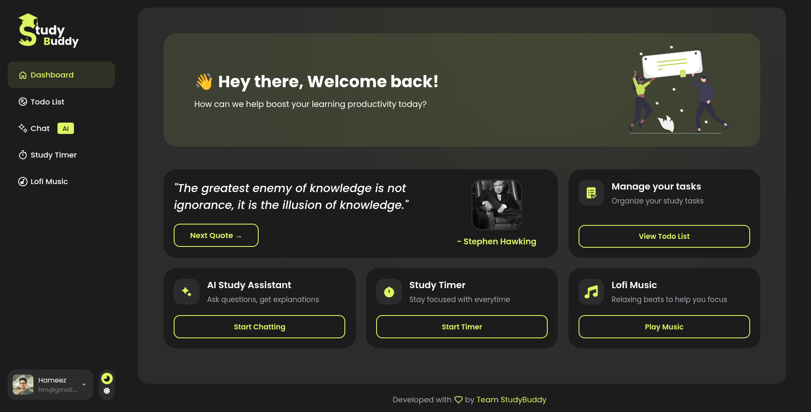

# Study Buddy 📚☕

Study Buddy brings your study tools into one place. Set a timer, keep track of tasks, play some lo-fi music, and ask questions when you get stuck.

Built by students, for students.



## Features

- **Study timer** — Pomodoro-style sessions to help you focus and take breaks.
- **To-do list** — Add, complete, and manage tasks, with your list saved to your account.
- **Lo-fi music player** — Background music for your study sessions.
- **AI study chat** — Ask study questions with help from Google Gemini.
- **Motivational quotes** — A little encouragement when you need it.

## Under the hood

- Account creation and login, with user information and tasks stored in SQLite.
- JWT authentication and password hashing with bcrypt.
- Light and dark modes, with a toggle and your choice saved in the browser.
- A responsive layout for phones, tablets, and desktops.
- Single-page navigation built with plain JavaScript, without React.
- A modern interface that keeps your study tools easy to reach.

## Tech stack

| Part           | Technologies            |
| -------------- | ----------------------- |
| Frontend       | HTML, CSS, JavaScript   |
| Backend        | Node.js, Express        |
| Database       | SQLite, better-sqlite3  |
| Authentication | JSON Web Tokens, bcrypt |
| AI chat        | Google Gemini API       |

## Getting started

You'll need Git, Node.js, npm, and a Gemini API key.

### 1. Clone the repository

```bash
git clone https://github.com/TeamStudyBuddy/study-buddy
cd study-buddy
```

### 2. Install dependencies

```bash
npm install
```

`npm i` works too. For a clean install using the committed lockfile, you can use `npm ci`.

### 3. Set up the environment

Create a file named `.env.development` in the project root:

```dotenv
PORT=5500
JWT_SECRET=change_this_in_production
JWT_EXPIRE=604800
GEMINI_API_KEY=your_gemini_api_key
```

Replace `your_gemini_api_key` with your own key. You can get one from [Google AI Studio](https://aistudio.google.com/apikey).

For a seven-day login session, use `JWT_EXPIRE=7d` instead of `604800`. The current authentication code passes this value as a string, and [jsonwebtoken interprets strings without a unit as milliseconds](https://github.com/auth0/node-jsonwebtoken#jwtsignpayload-secretorprivatekey-options-callback).

Use a strong, private value for `JWT_SECRET` before deploying. Keep environment files and API keys out of commits.

### 4. Start the app

```bash
npm start
```

Open [http://localhost:5500](http://localhost:5500) in your browser.

SQLite tables are created on startup. You don't need to run a separate database server.

### Development

To restart the server automatically when you change server files:

```bash
npm run dev
```

## Contributing

Bug fixes, feature ideas, design improvements, and documentation updates are welcome. Read [CONTRIBUTING.md](CONTRIBUTING.md) to get started.

## License

Licensed under the [MIT License](LICENSE).

Made with ❤️ **Team StudyBuddy**.
